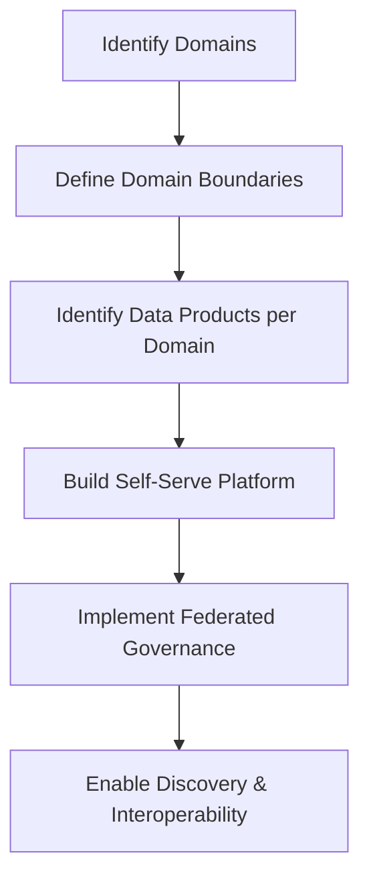

## The Four Principles

Data mesh rests on four pillars:

1. **Domain-Oriented Ownership**: Data owned by domain teams
2. **Data as a Product**: Treating data with product thinking
3. **Self-Serve Data Platform**: Infrastructure enabling autonomous teams
4. **Federated Computational Governance**: Balancing autonomy with interoperability

## Domain Data Products

Each domain exposes data as a product with clear contracts:

```yaml
# Data product manifest
apiVersion: datamesh/v1
kind: DataProduct
metadata:
  name: customer-360
  domain: customer-experience
  owner: customer-team
  version: 2.1.0
spec:
  description: |
    Unified customer view combining profile, transactions,
    and engagement data for analytics consumers.

  outputs:
    - name: customer_master
      type: table
      location: abfss://customer-domain@datalake.dfs.core.windows.net/products/customer-360/
      format: delta
      schema:
        fields:
          - name: customer_id
            type: string
            description: Unique customer identifier
            pii: false
          - name: email
            type: string
            description: Customer email address
            pii: true
            classification: MICROSOFT.PERSONAL.EMAIL
          - name: lifetime_value
            type: decimal(18,2)
            description: Calculated customer lifetime value
          - name: segment
            type: string
            description: Customer segment (premium/standard/basic)

  sla:
    freshness: PT1H  # Updated hourly
    availability: 99.9%
    latency:
      p50: 100ms
      p99: 500ms

  quality:
    expectations:
      - column: customer_id
        rule: not_null
      - column: email
        rule: valid_email
      - column: lifetime_value
        rule: ">= 0"

  lineage:
    upstream:
      - domain: sales
        product: transactions
      - domain: marketing
        product: campaigns
      - domain: support
        product: tickets
```

## Self-Serve Data Platform

The platform enables domain teams to create and manage data products:

```python
# Self-serve data product SDK
from datamesh_platform import DataProduct, DataProductBuilder

class CustomerDataProduct:
    def __init__(self):
        self.builder = DataProductBuilder(
            domain="customer-experience",
            name="customer-360"
        )

    def build(self) -> DataProduct:
        return (
            self.builder
            .with_source(
                name="crm_data",
                type="jdbc",
                connection="jdbc:sqlserver://crm.database.windows.net",
                table="customers"
            )
            .with_source(
                name="transaction_data",
                type="delta",
                path="abfss://sales-domain@datalake/products/transactions/"
            )
            .with_transformation(self._transform_customer_360)
            .with_quality_checks([
                {"column": "customer_id", "check": "unique"},
                {"column": "email", "check": "format:email"},
                {"column": "lifetime_value", "check": "range:0:1000000"}
            ])
            .with_output(
                format="delta",
                path="abfss://customer-domain@datalake/products/customer-360/",
                partition_by=["segment"]
            )
            .with_schedule("0 * * * *")  # Hourly
            .build()
        )

    def _transform_customer_360(self, spark):
        crm = spark.read.format("jdbc").load()
        transactions = spark.read.format("delta").load()

        return (
            crm
            .join(
                transactions.groupBy("customer_id").agg(
                    F.sum("amount").alias("total_spend"),
                    F.count("*").alias("transaction_count")
                ),
                on="customer_id",
                how="left"
            )
            .withColumn("lifetime_value", F.col("total_spend") * 1.2)
            .withColumn("segment",
                F.when(F.col("lifetime_value") > 10000, "premium")
                .when(F.col("lifetime_value") > 1000, "standard")
                .otherwise("basic")
            )
        )
```

## Federated Governance

Governance policies applied consistently across domains:

```python
# Federated governance policy
from governance_framework import Policy, PolicyEngine

class PIIHandlingPolicy(Policy):
    name = "pii-handling"
    version = "1.0"

    def validate(self, data_product: DataProduct) -> ValidationResult:
        issues = []

        for output in data_product.outputs:
            for field in output.schema.fields:
                if field.pii:
                    # PII must have classification
                    if not field.classification:
                        issues.append(f"PII field {field.name} missing classification")

                    # PII must have retention policy
                    if not output.retention_policy:
                        issues.append(f"Output with PII must have retention policy")

        return ValidationResult(
            passed=len(issues) == 0,
            issues=issues
        )

class DataQualityPolicy(Policy):
    name = "data-quality"
    version = "1.0"

    def validate(self, data_product: DataProduct) -> ValidationResult:
        issues = []

        # All products must have quality expectations
        if not data_product.quality or not data_product.quality.expectations:
            issues.append("Data product must define quality expectations")

        # Key fields must have not_null checks
        for output in data_product.outputs:
            key_fields = [f for f in output.schema.fields if f.is_key]
            for field in key_fields:
                has_null_check = any(
                    e.column == field.name and e.rule == "not_null"
                    for e in data_product.quality.expectations
                )
                if not has_null_check:
                    issues.append(f"Key field {field.name} must have not_null check")

        return ValidationResult(passed=len(issues) == 0, issues=issues)

# Apply policies during CI/CD
policy_engine = PolicyEngine([
    PIIHandlingPolicy(),
    DataQualityPolicy(),
    SchemaCompatibilityPolicy(),
    SLAPolicy()
])

result = policy_engine.validate(data_product)
if not result.passed:
    raise PolicyViolationError(result.issues)
```

## Data Product Discovery

A catalog enabling discovery across domains:

```graphql
# GraphQL API for data product discovery
type DataProduct {
  id: ID!
  name: String!
  domain: Domain!
  owner: Team!
  description: String!
  outputs: [DataOutput!]!
  sla: SLA!
  quality: QualityMetrics!
  lineage: Lineage!
  popularity: Int!
  lastUpdated: DateTime!
}

type Query {
  # Find products by domain
  productsByDomain(domain: String!): [DataProduct!]!

  # Search across all products
  searchProducts(
    query: String!
    filters: ProductFilters
  ): ProductSearchResult!

  # Get lineage for a product
  productLineage(productId: ID!): LineageGraph!

  # Get quality metrics
  productQuality(productId: ID!, timeRange: TimeRange): QualityReport!
}

type Mutation {
  # Register a new data product
  registerProduct(input: DataProductInput!): DataProduct!

  # Subscribe to product updates
  subscribeToProduct(productId: ID!, notificationConfig: NotificationConfig): Subscription!
}
```

## Practical Implementation Steps



## Challenges We've Seen

1. **Organizational Change**: Data mesh requires org structure changes
2. **Skill Distribution**: Not all domains have data engineering skills
3. **Governance Balance**: Finding the right level of federation
4. **Tooling Gaps**: The ecosystem is still maturing

## Is Data Mesh Right for You?

Consider data mesh if:
- You have distinct business domains
- Central data teams are bottlenecks
- Domain teams have engineering capabilities
- You can invest in platform engineering

Data mesh isn't a technology choice - it's an organizational paradigm shift. 2021 was about understanding it; 2022 will be about implementing it.

## Resources

- [Data Mesh - Zhamak Dehghani](https://martinfowler.com/articles/data-mesh-principles.html)
- [Data Mesh Architecture](https://www.datamesh-architecture.com/)
- [Azure Data Mesh Patterns](https://docs.microsoft.com/en-us/azure/architecture/example-scenario/data-warehouse/data-mesh)
