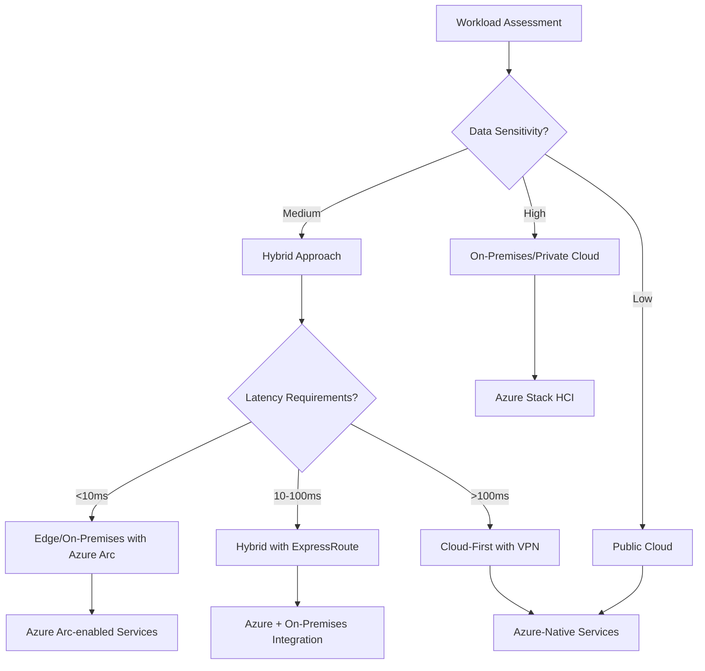

## Hybrid Cloud Patterns

### Pattern 1: Lift and Shift with Hybrid Connectivity

```bicep
// Azure VPN Gateway for hybrid connectivity
resource vpnGateway 'Microsoft.Network/virtualNetworkGateways@2022-01-01' = {
  name: 'hybrid-vpn-gateway'
  location: resourceGroup().location
  properties: {
    gatewayType: 'Vpn'
    vpnType: 'RouteBased'
    sku: {
      name: 'VpnGw2'
      tier: 'VpnGw2'
    }
    ipConfigurations: [
      {
        name: 'default'
        properties: {
          privateIPAllocationMethod: 'Dynamic'
          subnet: {
            id: gatewaySubnet.id
          }
          publicIPAddress: {
            id: publicIp.id
          }
        }
      }
    ]
  }
}

// Local network gateway representing on-premises
resource localNetworkGateway 'Microsoft.Network/localNetworkGateways@2022-01-01' = {
  name: 'onprem-gateway'
  location: resourceGroup().location
  properties: {
    localNetworkAddressSpace: {
      addressPrefixes: [
        '10.0.0.0/16'  // On-premises network range
      ]
    }
    gatewayIpAddress: '203.0.113.1'  // On-premises VPN device IP
  }
}

// VPN Connection
resource vpnConnection 'Microsoft.Network/connections@2022-01-01' = {
  name: 'hybrid-connection'
  location: resourceGroup().location
  properties: {
    connectionType: 'IPsec'
    virtualNetworkGateway1: {
      id: vpnGateway.id
    }
    localNetworkGateway2: {
      id: localNetworkGateway.id
    }
    sharedKey: 'your-shared-key'
    enableBgp: false
  }
}
```

### Pattern 2: Cloud Bursting

```csharp
public class CloudBurstingService
{
    private readonly IConfiguration _config;
    private readonly ILogger _logger;

    public async Task<ComputeLocation> DetermineComputeLocationAsync(WorkloadRequest request)
    {
        // Check on-premises capacity
        var onPremCapacity = await GetOnPremCapacityAsync();
        var estimatedLoad = CalculateLoad(request);

        if (onPremCapacity.AvailableCapacity >= estimatedLoad)
        {
            _logger.LogInformation("Processing on-premises");
            return ComputeLocation.OnPremises;
        }

        // Burst to cloud
        _logger.LogInformation("Bursting to Azure");
        return ComputeLocation.Azure;
    }

    public async Task ProcessWorkloadAsync(WorkloadRequest request)
    {
        var location = await DetermineComputeLocationAsync(request);

        switch (location)
        {
            case ComputeLocation.OnPremises:
                await ProcessOnPremisesAsync(request);
                break;

            case ComputeLocation.Azure:
                await ProcessInAzureAsync(request);
                break;
        }
    }

    private async Task ProcessInAzureAsync(WorkloadRequest request)
    {
        // Scale out Azure Container Instances
        var containerGroup = new ContainerGroupData(AzureLocation.EastUS)
        {
            Containers =
            {
                new ContainerInstanceContainer("worker")
                {
                    Image = "myregistry.azurecr.io/worker:latest",
                    Resources = new ContainerResourceRequirements(
                        new ContainerResourceRequestsContent(1.0, 2.0))
                }
            },
            OSType = ContainerInstanceOperatingSystemType.Linux,
            RestartPolicy = ContainerGroupRestartPolicy.Never
        };

        // Deploy and process
        await _containerClient.CreateOrUpdateAsync(
            WaitUntil.Completed,
            $"worker-{request.Id}",
            containerGroup);
    }
}

public enum ComputeLocation
{
    OnPremises,
    Azure
}
```

### Pattern 3: Data Tiering

```sql
-- Hot data in Azure SQL Database
-- Warm data in Azure Cosmos DB
-- Cold data in Azure Blob Storage

-- Implement data lifecycle management
CREATE PROCEDURE dbo.ArchiveOldData
    @DaysToKeep INT = 90
AS
BEGIN
    SET NOCOUNT ON;

    DECLARE @ArchiveDate DATE = DATEADD(DAY, -@DaysToKeep, GETDATE());
    DECLARE @ColdArchiveDate DATE = DATEADD(DAY, -365, GETDATE());

    -- Move to warm storage (Cosmos DB via linked server or external table)
    INSERT INTO OPENROWSET(
        'CosmosDB',
        'Account=myaccount;Database=archive;Collection=transactions',
        'SELECT * FROM dbo.Transactions WHERE TransactionDate < @ArchiveDate')
    SELECT *
    FROM dbo.Transactions
    WHERE TransactionDate < @ArchiveDate
      AND TransactionDate >= @ColdArchiveDate;

    -- Delete archived data from hot storage
    DELETE FROM dbo.Transactions
    WHERE TransactionDate < @ArchiveDate;

    -- Log archival
    INSERT INTO dbo.ArchiveLog (ArchiveDate, RecordsArchived, TargetStorage)
    VALUES (GETDATE(), @@ROWCOUNT, 'CosmosDB');
END;
```

```python
# Python script for cold storage archival
import pandas as pd
from azure.storage.blob import BlobServiceClient
from azure.cosmos import CosmosClient
import json

class DataTieringService:
    def __init__(self, cosmos_conn, blob_conn):
        self.cosmos = CosmosClient.from_connection_string(cosmos_conn)
        self.blob = BlobServiceClient.from_connection_string(blob_conn)

    def archive_to_cold_storage(self, days_threshold=365):
        """Move data older than threshold from Cosmos to Blob Storage"""
        database = self.cosmos.get_database_client("archive")
        container = database.get_container_client("transactions")

        # Query old data
        query = f"""
            SELECT * FROM c
            WHERE c.transactionDate < DateTimeAdd('day', -{days_threshold}, GetCurrentDateTime())
        """

        old_records = list(container.query_items(query, enable_cross_partition_query=True))

        if not old_records:
            return 0

        # Archive to blob storage
        blob_container = self.blob.get_container_client("cold-archive")
        archive_date = datetime.now().strftime("%Y/%m/%d")
        blob_name = f"transactions/{archive_date}/archive.json"

        blob_client = blob_container.get_blob_client(blob_name)
        blob_client.upload_blob(json.dumps(old_records), overwrite=True)

        # Delete from Cosmos
        for record in old_records:
            container.delete_item(record['id'], partition_key=record['partitionKey'])

        return len(old_records)
```

### Pattern 4: Disaster Recovery

```yaml
# Azure Site Recovery configuration
recovery_vault:
  name: hybrid-recovery-vault
  location: eastus2  # Secondary region
  sku: Standard

replication_policy:
  name: 24-hour-rpo
  recovery_point_retention_hours: 24
  app_consistent_frequency_hours: 4
  replication_interval_seconds: 300

protected_items:
  - name: webserver-01
    source: onpremises-vmware
    target_resource_group: dr-resources
    target_virtual_network: dr-vnet
    failover_priority: 1

  - name: sqlserver-01
    source: onpremises-vmware
    target_resource_group: dr-resources
    target_virtual_network: dr-vnet
    failover_priority: 2

recovery_plans:
  - name: full-site-failover
    groups:
      - order: 1
        items: [sqlserver-01]
        pre_action: "Stop SQL replication"
        post_action: "Verify SQL connectivity"
      - order: 2
        items: [webserver-01]
        pre_action: "Update DNS"
        post_action: "Verify web app"
```

### Hybrid Identity

```powershell
# Azure AD Connect configuration for hybrid identity
# Synchronize on-premises Active Directory with Azure AD

# Install Azure AD Connect on designated server
# Configure sync options:
$syncConfig = @{
    SourceAnchor = "objectGUID"
    SyncInterval = 30  # minutes
    PasswordHashSync = $true
    PassthroughAuth = $false
    Seamless SSO = $true
}

# Configure filtering (sync specific OUs)
$ouFilter = @(
    "OU=Employees,DC=contoso,DC=com",
    "OU=Groups,DC=contoso,DC=com"
)

# Enable hybrid Azure AD join
# Devices registered both on-premises and in Azure AD
```

## Architecture Decision Framework



## Best Practices

1. **Assess workloads** - Understand requirements before choosing location
2. **Plan connectivity** - ExpressRoute for production, VPN for dev/test
3. **Unified management** - Use Azure Arc for consistent operations
4. **Security first** - Extend identity and security controls
5. **Monitor everything** - Centralize monitoring in Azure Monitor

Hybrid cloud strategies provide flexibility while meeting compliance and performance requirements.
