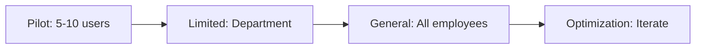

As organizations hand Custom GPTs to teams, my focus has been on governance, access control, and sensible defaults. These notes outline how enterprises can use Custom GPTs safely while preserving productivity.

## Custom GPTs vs. Assistants API

Understanding when to use each:

| Feature | Custom GPTs | Assistants API |
|---------|-------------|----------------|
| Creation | No-code builder | Code required |
| Hosting | OpenAI ChatGPT | Your infrastructure |
| Access Control | ChatGPT Enterprise | Your auth system |
| Data Residency | OpenAI | Azure/your cloud |
| Customization | Limited | Full control |
| Cost Model | Subscription | Per-token |

For enterprises with ChatGPT Enterprise, Custom GPTs are ideal for internal tools. For customer-facing applications, use the Assistants API.

## Enterprise Use Cases

### 1. HR Policy Assistant

```markdown
# HR Policy Assistant Instructions

You are the company HR Policy Assistant. Your role is to help employees understand company policies and procedures.

## Your Knowledge
- You have access to the Employee Handbook (uploaded)
- You know company policies for PTO, benefits, and workplace conduct
- You can explain processes for common HR requests

## Guidelines
- Always cite specific policy sections when answering
- If a policy doesn't exist, say so clearly
- For sensitive matters (harassment, legal), direct users to HR directly
- Never give legal advice
- Use a friendly, professional tone

## What You Can Help With
- PTO policies and calculations
- Benefits enrollment questions
- Expense reimbursement process
- Performance review timeline
- Remote work policies

## What You Should Escalate
- Specific compensation questions -> HR manager
- Legal concerns -> Legal department
- Harassment reports -> HR confidential line
- Medical accommodations -> HR specialist
```

### 2. Code Review Assistant

```markdown
# Code Review Assistant Instructions

You are a senior software engineer helping team members with code reviews.

## Your Expertise
- Languages: Python, TypeScript, C#, SQL
- Frameworks: FastAPI, React, .NET
- Standards: Our coding guidelines (uploaded)

## Review Approach
1. First, understand the intent of the code
2. Check for:
   - Logic errors and edge cases
   - Security vulnerabilities (OWASP Top 10)
   - Performance issues
   - Code style violations
   - Missing tests
3. Provide specific, actionable feedback
4. Suggest improvements with code examples

## Output Format
For each issue found:
```
**[Severity: High/Medium/Low]** Brief description
Location: file.py, line X
Issue: Detailed explanation
Suggestion: How to fix with code example
```

## Guidelines
- Be constructive, not critical
- Explain the "why" behind suggestions
- Acknowledge good patterns when you see them
- Prioritize security and correctness over style
```

### 3. Sales Enablement Assistant

```markdown
# Sales Enablement Assistant

You help the sales team with product information, competitive intelligence, and customer communication.

## Your Knowledge Base
- Product documentation and pricing
- Competitive comparison sheets
- Case studies and success stories
- FAQ documents
- Objection handling guides

## What You Can Do
1. **Answer Product Questions**
   - Features and capabilities
   - Pricing and packaging
   - Technical requirements
   - Integration options

2. **Competitive Intelligence**
   - Compare our product vs competitors
   - Highlight differentiators
   - Address competitive objections

3. **Draft Communications**
   - Follow-up emails
   - Proposal introductions
   - Meeting summaries

## Guidelines
- Always use accurate, current pricing
- Don't make up features we don't have
- Qualify uncertain information
- Maintain our brand voice: professional but approachable
```

## Governance Framework

### Access Control Strategy

```yaml
# GPT Access Policy Structure
categories:
  public_internal:
    description: "Available to all employees"
    examples:
      - HR Policy Assistant
      - IT Help Desk
      - Company Directory
    approval: Automatic
    review_frequency: Quarterly

  department_specific:
    description: "Limited to specific departments"
    examples:
      - Sales Enablement (Sales only)
      - Financial Analysis (Finance only)
      - Legal Research (Legal only)
    approval: Department head
    review_frequency: Monthly

  sensitive:
    description: "Contains confidential data"
    examples:
      - M&A Research
      - Executive Briefing
      - Compensation Analysis
    approval: C-level + Legal
    review_frequency: Weekly
```

### Data Classification

```python
# Framework for evaluating GPT data sensitivity

class GPTDataClassifier:
    CLASSIFICATION_RULES = {
        "public": {
            "description": "Publicly available information",
            "examples": ["Product docs", "Public FAQ", "Blog content"],
            "restrictions": None
        },
        "internal": {
            "description": "Internal but not sensitive",
            "examples": ["Org charts", "Process docs", "Training materials"],
            "restrictions": ["No external sharing"]
        },
        "confidential": {
            "description": "Business-sensitive information",
            "examples": ["Pricing", "Strategy docs", "Competitive intel"],
            "restrictions": ["Need-to-know access", "No copying"]
        },
        "restricted": {
            "description": "Highly sensitive data",
            "examples": ["PII", "Financial data", "Legal matters"],
            "restrictions": ["Strict access control", "Audit logging", "DLP required"]
        }
    }

    def classify_gpt_data(self, uploaded_files: list[str]) -> str:
        """Determine highest classification level of GPT data."""
        highest_level = "public"
        levels = ["public", "internal", "confidential", "restricted"]

        for file in uploaded_files:
            file_level = self._classify_file(file)
            if levels.index(file_level) > levels.index(highest_level):
                highest_level = file_level

        return highest_level

    def _classify_file(self, filename: str) -> str:
        """Classify individual file - implement your logic."""
        # Check filename patterns, content, metadata
        pass
```

### Monitoring and Audit

```python
# Custom GPT usage monitoring (conceptual - actual implementation
# depends on ChatGPT Enterprise admin features)

from dataclasses import dataclass
from datetime import datetime

@dataclass
class GPTUsageEvent:
    timestamp: datetime
    user_email: str
    gpt_name: str
    conversation_id: str
    message_count: int
    files_accessed: list[str]

class GPTAuditLogger:
    def __init__(self, storage):
        self.storage = storage

    async def log_usage(self, event: GPTUsageEvent):
        """Log GPT usage for audit trail."""
        await self.storage.append("gpt_audit_log", {
            **event.__dict__,
            "timestamp": event.timestamp.isoformat()
        })

    async def generate_usage_report(
        self,
        start_date: datetime,
        end_date: datetime
    ) -> dict:
        """Generate usage report for compliance."""

        events = await self.storage.query(
            "gpt_audit_log",
            filter=f"timestamp >= '{start_date}' AND timestamp <= '{end_date}'"
        )

        return {
            "period": f"{start_date} to {end_date}",
            "total_conversations": len(set(e["conversation_id"] for e in events)),
            "unique_users": len(set(e["user_email"] for e in events)),
            "by_gpt": self._group_by_gpt(events),
            "top_users": self._top_users(events, 10),
            "sensitive_file_access": self._sensitive_access(events)
        }
```

## Best Practices for GPT Creation

### 1. Clear Scope Definition

```markdown
# Template: GPT Scope Document

## Purpose
[One sentence describing what this GPT does]

## Target Users
[Who should use this GPT]

## Capabilities
- [Specific thing it can do]
- [Another capability]

## Limitations
- [What it cannot/should not do]
- [Topics it should decline]

## Data Sources
- [Document 1] - Classification: [Level]
- [Document 2] - Classification: [Level]

## Escalation Paths
- [Topic] -> [Person/Team]

## Review Schedule
- Owner: [Name]
- Review frequency: [Weekly/Monthly/Quarterly]
```

### 2. Effective Instructions

```markdown
# Good Instructions Structure

## Identity
Who you are and your expertise level

## Knowledge Context
What documents you have access to and how to use them

## Task Guidelines
Step-by-step approach for common tasks

## Output Format
How to structure responses

## Boundaries
What to do and not do

## Tone and Style
How to communicate
```

### 3. Testing Protocol

Before deploying a Custom GPT:

1. **Functional testing** - Does it answer correctly?
2. **Edge case testing** - How does it handle unusual inputs?
3. **Security testing** - Can it be jailbroken?
4. **Accuracy testing** - Are citations correct?
5. **User acceptance** - Does it meet user needs?

## Rollout Strategy



Each phase should include:
- User feedback collection
- Usage analytics review
- Instruction refinement
- Security assessment

## Conclusion

Custom GPTs democratize AI tool creation but require enterprise governance. Balance empowerment with control through clear policies, data classification, and monitoring. Start with low-risk internal tools and expand as you build confidence and processes.

The organizations that master Custom GPT governance will unlock significant productivity gains while managing risk effectively.
